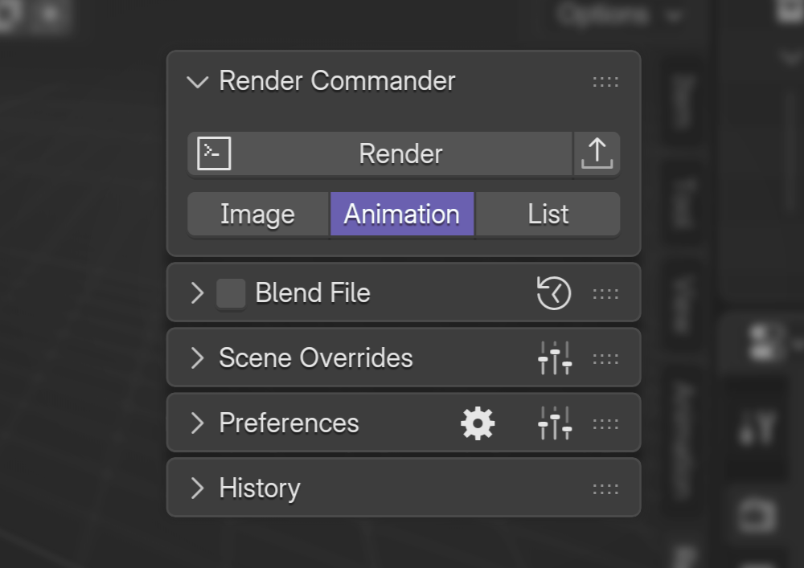
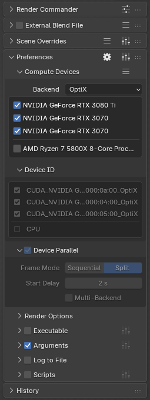
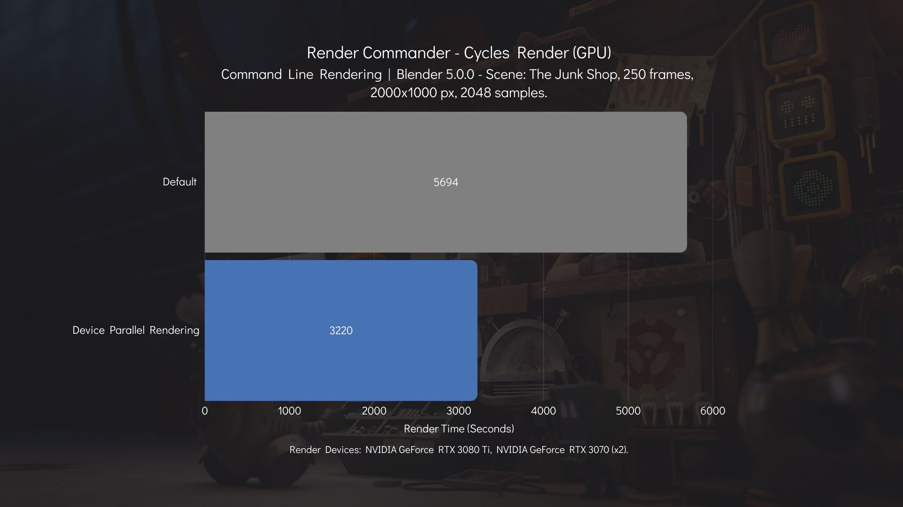
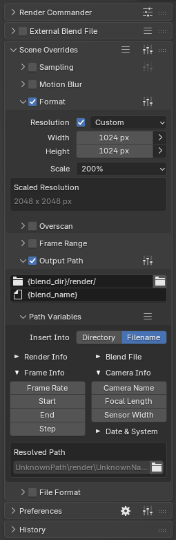
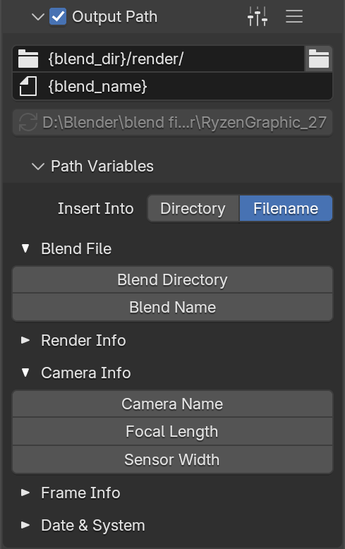
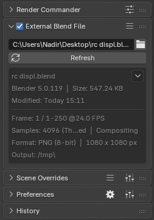
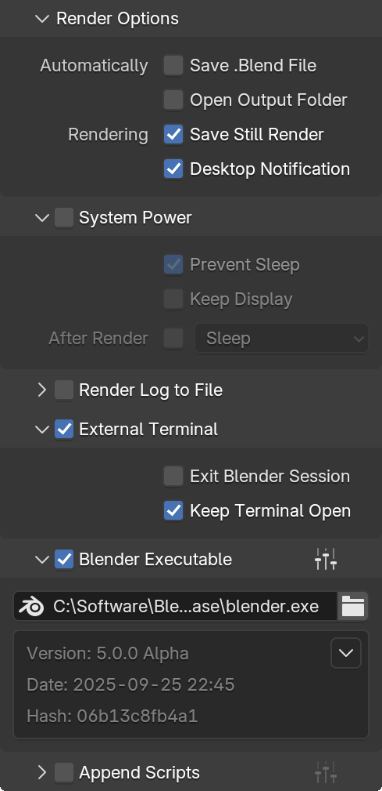

# Render Commander

Blender add‑on for background rendering with multi‑GPU support.

This addon provides a simple and intuitive UI to configure a set of common render settings.
It compiles all selected options into a temporary Python file, which is then attached to a Blender command-line render execution.
This approach enables fast, efficient, and fully automated background renders without manual setup.



## Table of Contents

1. [Features](#features)  
2. [Screenshots](#screenshots)  
3. [Installation](#installation)  
4. [Usage](#usage)  
5. [Build from Source](#build-from-source)  

## Features

### Device-Parallel Rendering

The addon uses its own render-device selection and automates your rendering workflow by launching a separate background Blender instance for each enabled compute device. It also supports rendering across multiple back‑ends simultaneously.

### Render Presets & Overrides

Tweak resolution, samples, output paths, and more, without altering your original scene. Save and reuse presets for different project stages (draft, final, client review, etc.).

### External Blend Files

Render scenes stored in external `.blend` files without opening them in Blender.
Preview scene settings, apply overrides, and start renders directly from the add-on panel.

### Advanced Options

- **Desktop Notifications** – Get notified when a render job finishes.

- **System Power Control** – Keeps your PC awake during renders and can automatically sleep or shut down once all jobs are complete.

- **Custom Blender Executables** – Define custom Blender paths to use different versions or builds.

- **Append Python Scripts** – Attach your own Python scripts to render jobs for logging, post-processing, or pipeline integration.

## Screenshots

     

---

## Requirements

- Blender 4.2 - 5.0
- Windows 11, Linux

## Installation

1. Download the latest release from the [Releases](https://github.com/n4dirp/render-commander/releases) page.
2. In Blender, go to **Edit > Preferences > Get Extensions.**
3. Click **Install from Disk…** and select the downloaded `.zip` file.
4. Enable the add-on by checking the box next to **Render Commander**.

## Usage

1. Open the **Render Commander** panel in the **Viewport Sidebar** panel.
2. Choose a render mode: **Image**, **Animation**, or **Frame List**.
3. Optionally: 
    - Apply a preset or override specific settings.
    - In the Add‑on Preferences, select the render devices for ***Cycles Render***.
4. Click **Render** > your render job starts immediately.

## Build from Source

```bash
git clone https://github.com/n4dirp/Render-Commander.git
cd Render-Commander/render_commander
blender --command extension build --split-platforms
```

---

### Contribute

Pull requests welcome! See the repository for issues and guidelines.  

--- 

Happy rendering! 🚀
