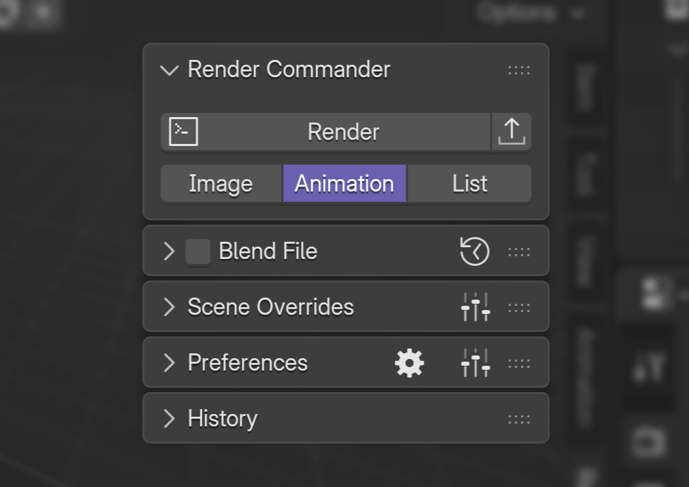

# Render Commander

[](https://github.com/n4dirp/Render-Commander/releases)
[](https://github.com/n4dirp/Render-Commander)
[](https://www.blender.org/)


Render Commander streamlines your workflow by enabling **background rendering** and **multi-GPU management** directly from Blender. It compiles your render settings into standalone scripts, giving you the flexibility to launch jobs immediately or export them for later execution.



## Features

### Multi-Process and Device-Parallel Rendering

Cycles Render: Automate your rendering workflow by launching a separate background Blender instance for each enabled compute device. The system supports multiple frame allocation strategies and can render across different backends simultaneously.
For EEVEE, you can optimize sequence rendering by running multiple parallel processes on a single GPU (limited by VRAM).


### Render Presets & Overrides

Tweak resolution, samples, output paths, and more, without altering your original scene. Save and reuse presets for different project stages (draft, final, client review, etc.).

### External Blend Files

Render scenes stored in external `.blend` files without opening them in Blender.
Preview scene settings, apply overrides, and start renders directly from the add-on panel.

### Advanced Options

- **Desktop Notifications** – Get notified when a render job finishes.

- **System Power Control** – Keeps your PC awake during renders and can automatically sleep or shut down once all jobs are complete.

- **Custom Blender Executables** – Define custom Blender paths to use different versions or builds.

- **Append Python Scripts** – Attach your own Python scripts to render jobs for logging, post-processing, or pipeline integration.

## Requeriments

The add-on is compatible with **Blender 4.2 LTS** to **5.0** on  **Windows** and **Linux**.

For **Blender 5.1**+ use the **Python 3.13 build** of the add-on: [Render Commander - Python 3.13](https://github.com/n4dirp/Render-Commander/releases/download/v1.1.2/render_commander-1.1.2_python_3.13.zip)

## Installation

1. Download the latest release from the [Releases](https://github.com/n4dirp/render-commander/releases) page.
2. Drag and drop the `.zip` into Blender to install the add-on.

## Location
- **Viewport Sidebar**: Main add-on panel is available in the *Render Commander* tab.
- **Topbar**: Additional controls are available in the *Render* menu.

## Build from Source

```bash
git clone https://github.com/n4dirp/Render-Commander.git
cd Render-Commander/render_commander
blender --command extension build --split-platforms
```
